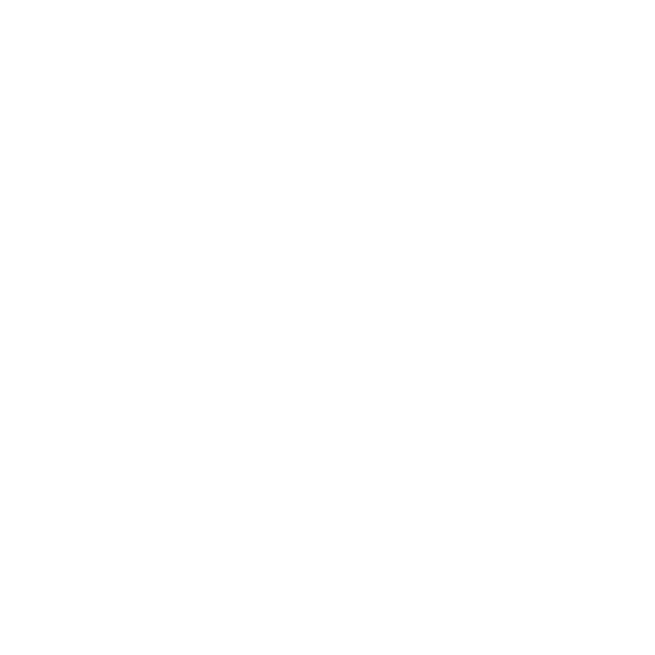
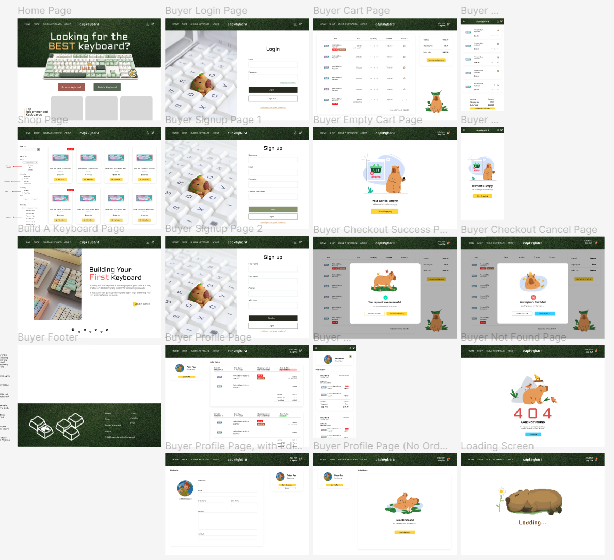
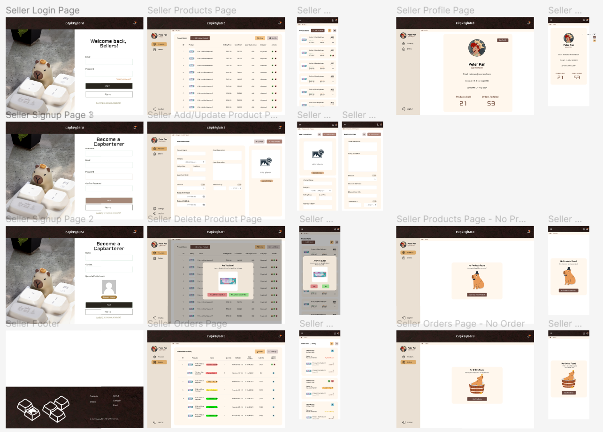
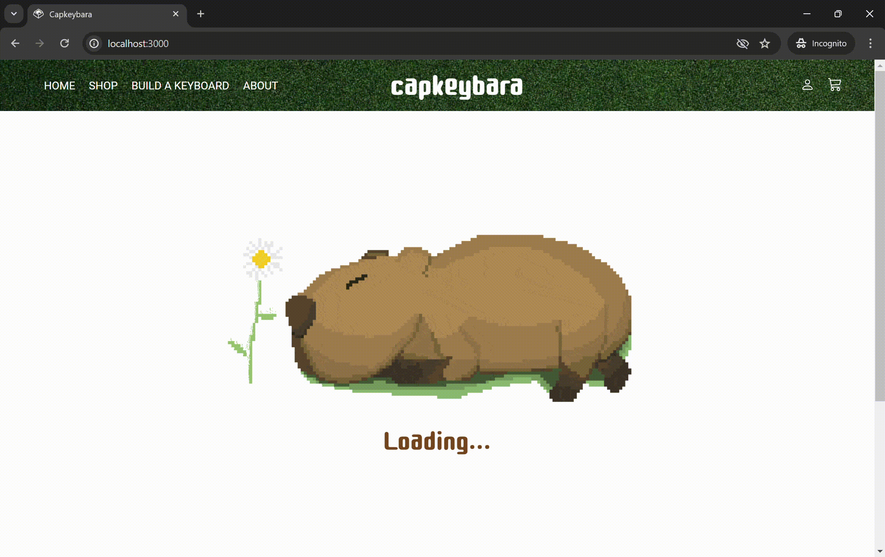
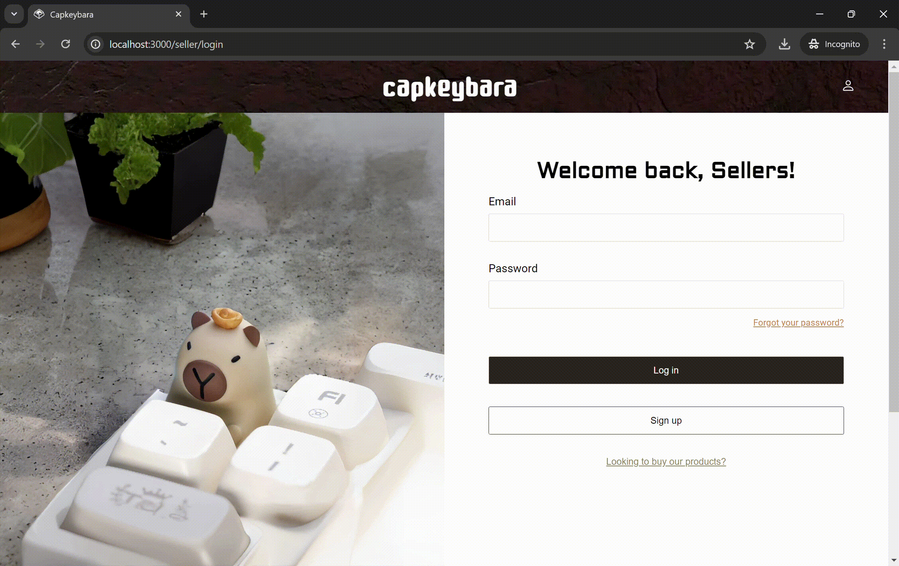
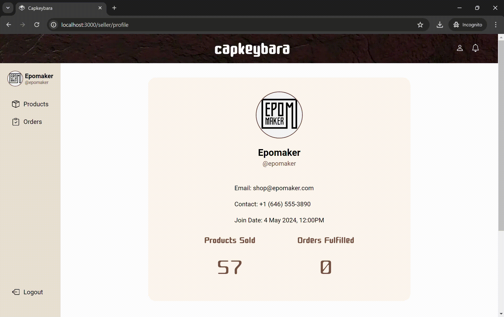
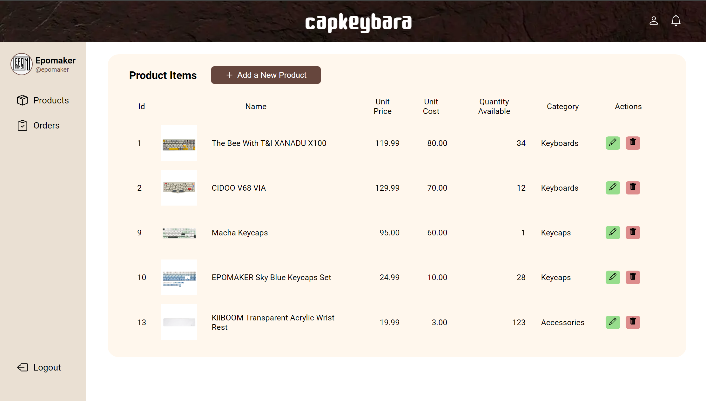
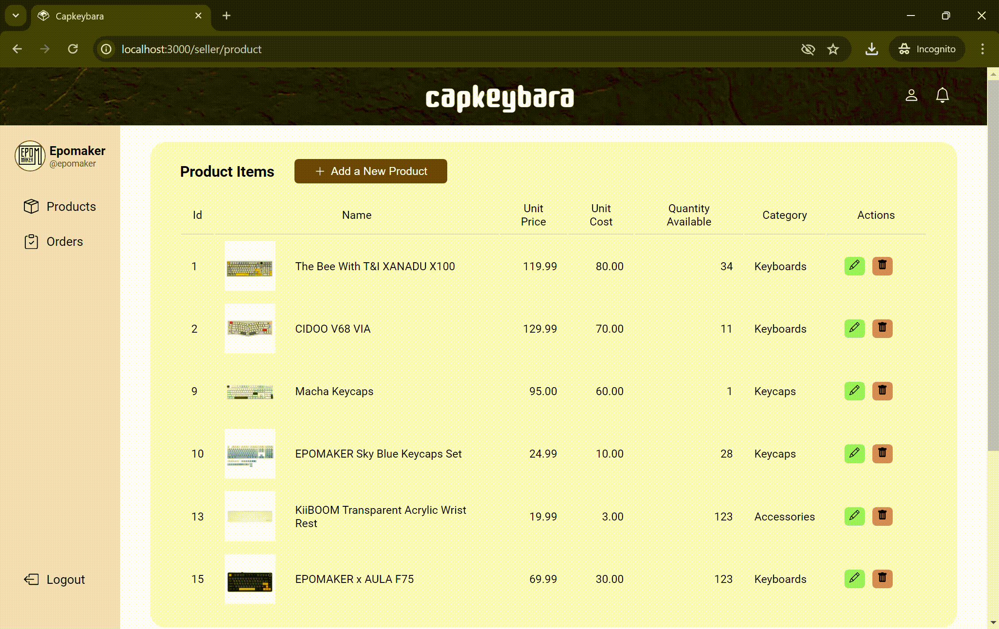
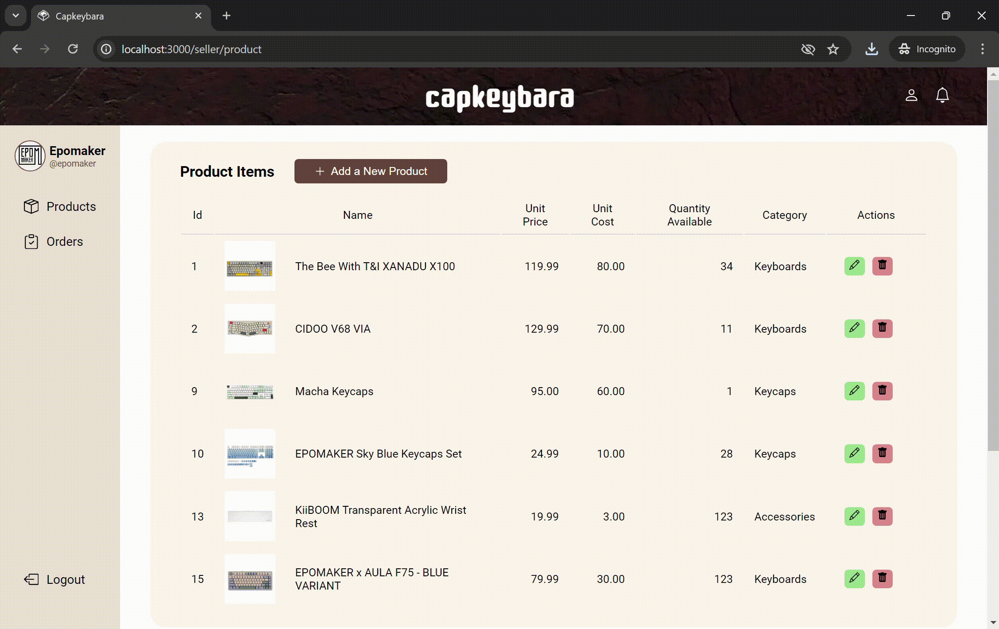
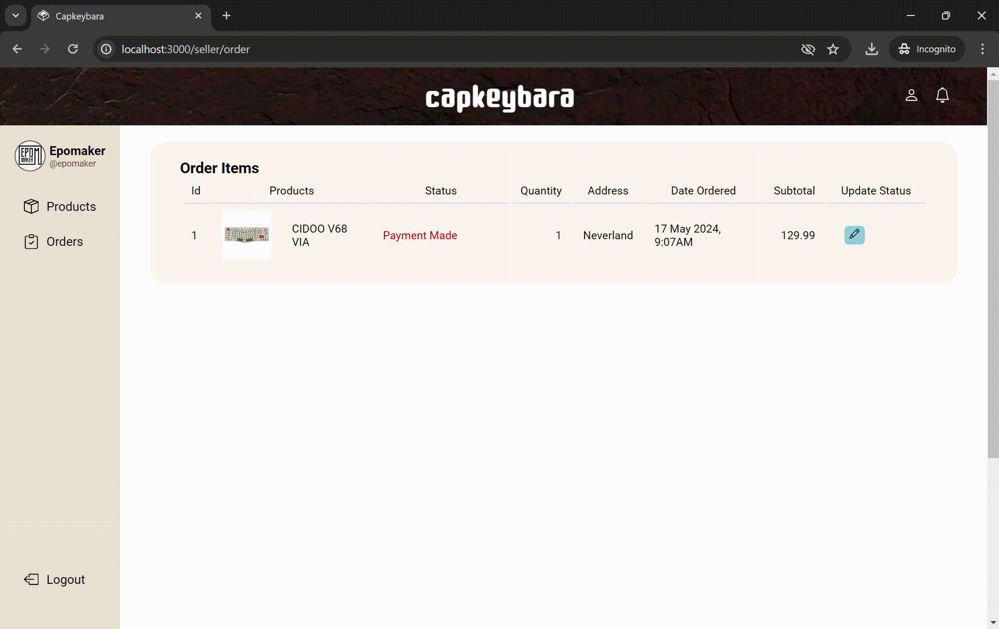

# Capkeybara (Frontend)
[Capkeybara](https://capkeybara.netlify.app/) is THE ultimate e-commerce platform for top-notch mechanical keyboard components that cater to all your needs! 

<p align="center">
  
</p>

Whether you're a seasoned keyboard enthusiast, a newbie exploring the world of mechanical keyboards, or simply on the hunt for a quick upgrade, we've got you covered! We are here guide you with expert advice to ensure you make the perfect choice every time you hit that "add to cart" button!

* [Frontend Repository](https://github.com/f-lsq/capkeybara-frontend) (ReactJS - useForm, Toastify, Styled Components)
* [Backend Repository](https://github.com/f-lsq/capkeybara-backend) (NodeJS - Express, Handlebars, Bookshelf ORM with knex, DB-migrate, Cloudinary, Stripe, and MySQL)

<!-- Begin with your project name, and a summary of what your project is about. Briefly describe the motivations of the owners who kickstarted this project. Treat it as an elevator pitch for your project.

* Describe the context and goals of your project
* Make sure to justify why the project should exists
* Include a URL to the deployed version of your project -->

## Table of Contents
1. [UI/UX](#uiux)
2. [Features](#features)
3. [Technologies Used](#technologies-used)
4. [Deployment](#deployment)
5. [Credits](#credits)
6. [References](#references)

## UI/UX

<!-- This section should talk about the 

* List down the user stories and their acceptance criteria.
* Share links to wireframes, mockups, diagrams that are used in the UI/UX processes. Those files can be pushed to the Github repository, or be placed in a separate PDF file as part of the repository.
* Describe what your considerations were for the Five Planes of UI/UX, such as the choice of colour and fonts for the surface plane, or information organisation strategy for the structure plane. -->

### User Stories
1. As a *keyboard hobbyist* (regular), I want to browse the available keyboard accessories, so that I can make modifications to my current keyboard(s).
2. As a *beginner* (uncertain), I want to follow a step by step guide on how to build a keyboard, or even purchase a starter pack containing keyboard components, so that I can start building my first keyboard easily.
3. As a *buyer* (spontaneous), I want to browse the pre-built keyboards, add them to my cart, checkout and track my orders in real time, so that I will be able to receive and use the keyboard quickly.
4. As a *vendor*, I want to list my products and manage my orders, so that I can increase the reach of my products and make more profits.
5. As an *admin*, I want to be able to perform CRUD on the users, sellers and other tables in the database, so that the site remains clean, with no redundant data or disruptive users.

### Wireframes
Below are the wireframes for both the buyers, and seller pages. The link to the Figma project can be accessed [here](https://www.figma.com/design/6GzeGtguNyc9KlLTqTjQqW/Capkeybara?node-id=155%3A38&t=FTLRmqNO8eSulcjp-1).


#### Wireframe for Buyer Pages


#### Wireframe for Seller Pages


### Mockups
#### Landing Page


#### Shop Page


#### Build a Keyboard Page


#### About Page


#### Not Found Page


#### Loading Page


#### Buyer Sign Up Page


#### Buyer Log In Page


#### Buyer Profile Page


#### Buyer Cart Page


#### Buyer Checkout Success Page


#### Buyer Checkout Cancel Page


#### Seller Sign Up Page


#### Seller Log In Page


#### Seller Profile Page


#### Seller Product Page

*(This is not a GIF)*

#### Seller Add Product Page


#### Seller Update Product Page


#### Seller Delete Product Page


#### Seller Order Page


### Choice of Color and Information Organisation
Capkeybara was mainly inspired by the rodent itself. The site aims to blend cuteness with its actual theme being a mechanical keyboard e-commerce store. The color scheme for the buyers page was also derived images of the capybara, as seen in the image below.


As the site is aimed for all consumers alike, be it keyboard enthusiast, regular shoppers, or even beginners just starting out, the landing page is organised to cater to these different target audiences. 
* `Browse Keyboard` button allows both keyboard hobbyist and regular consumer looking for a quick buy to directly browse the selection of keyboard the site has to offer, with just a click.
* `Build a Keyboard` button enables beginners to effectively move to the relevant page to read up and learn about the ways to build a keyboard. Once they have gone through the tutorial style guide, they will then be redirected to the shop to purchase their first keyboard, or keyboard components.

## Features
<!-- List down the major features of your application, and also the algorithms that you have used to implement those features. If there are any limitations or bugs, please describe them as well. If you have any features pending implementation, you can also take the opportunity to discuss them here. -->
Major features of capkeybara includes
1. **Search**, which makes use of algorithm such as mergesort for sorting (Not implemented yet)
2. **Image upload** for buyer and seller profile picture and product images. The cloudinary upload widget was used for this feature.
2. **Checkout**, which is handled by Stripe. A session ID will be generated from Stripe and received by the client to indicate a successful transaction. <br> The main limitation of this is that users are able to skip the checkout process and make an order by navigating to the `/checkout/success` page. A possible solution for this is to validate the session ID sent by Stripe before placing an order.
3. **Order Status**, which allows buyers to check the status of their order. They include `Payment Made`, `Ready to Ship`, `Out for Delivery`, `Delivered`. <br> A limitation of this from the seller side is that the status of an order can only be update once all products in an order meets the order status requirement (eg. order status can only be updated to 'Delivered' if all products in the order has been delivered). Changing this order status will also update the order status for all sellers.

## Technologies Used
<!-- Provide an overview of the languages, frameworks, libraries and any other tools that you have used to produce the project.  Be sure to provide a short description of where in the project the technology is used, and a URL to its Github repository.  -->
### Frontend
* [ReactJS](https://react.dev/reference/react) - Route access restriction, navigation between pages, form control using useForm
* [Cloudinary](https://cloudinary.com/documentation/upload_widget) - Image upload widget for buyer and seller and product images

### Backend
* [NodeJS](https://nodejs.org/en) - Server environment. [ExpressJS](https://expressjs.com/), [Handlebars](https://handlebarsjs.com/) for admin page templating, [Sessions](https://expressjs.com/en/resources/middleware/session.html), JWT with bcrypt for Authentication, [Bookshelf ORM](https://bookshelfjs.org/) with knex, [Stripe](https://stripe.com/) for payment processing and [caolan form](https://github.com/caolan/forms) for form control.
* [MySQL](https://www.mysql.com/) - Database management, used in conjuntion with [db-migrate](https://db-migrate.readthedocs.io/en/latest/)


## Deployment

<!-- Describe the process that you used to host your website on a hosting platform (such as Github pages or Heroku). Provide the following details:

1.	What is your hosting platform?
2.	How is the database hosted?
3.	What are the environment variables and what are they responsible for?
4.	What are the dependencies that your project used?
5.	What are the deployment steps for the project?

You can provide deployment details in a separate document (PDF or another markdown file). There is no need to be original for this section; if another website or document have the steps, just link there and acknowledge the author in your credits. -->
### Live Links
* [React Frontend - Main Page](https://capkeybara.netlify.app/) (Netlify)
* [Express Backend - Admin Page](https://capkeybara-backend.onrender.com/) (Render)

*(Note that Admin Page is not yet implemented)*

### Test Accounts
| Account Type | Name                                                       | Email                     | Password          | 
|--------------|------------------------------------------------------------|--------------------------|-------------------|
| Buyer        | [Peter Pan](https://en.wikipedia.org/wiki/Peter_Pan)       | peterpan@neverland.com    | peterpan123@      |
| Buyer        | [Tinker Bell](https://en.wikipedia.org/wiki/Tinker_Bell)   | tinkerbell@neverland.com  | tinkerbell123@    | 
| Buyer        | [Captain Hook](https://en.wikipedia.org/wiki/Captain_Hook) | captainhook@neverland.com | captainhook123@   |
| Seller       | [Epomaker](https://epomaker.com/)                          | shop@epomaker.com         | epomaker123@      |
| Seller       | [Aula](https://www.aulastar.com/)                          | shop@aula.com             | aula123@          |
| Seller       | [Keychron](https://www.keychron.com/)                      | shop@keychron.com         | keychron123@      |

No test admin account will be provided.

## Credits
<!-- Put here all the code, content and assets that you have used. If you have used a piece of code from an external website, please acknowledge it and provide a link to it.  -->
Links to all assets are listed here. 
* Logo and Footer - [Capybara](https://thenounproject.com/icon/capybara-470903/), [Keycap](https://cloudnineergo.com/products/cloud-nine-c989m-ergonomic-keyboard)
* Landing Page - [Macha Keys](https://goblintechkeys.com/products/matcha-keycaps)
* Navbar Background - [Buyer](https://www.peakpx.com/en/hd-wallpaper-desktop-erpre), [Seller](https://www.vecteezy.com/photo/33889356-stone-texture-brown-for-interior-wallpaper-background-or-cover)
* Signup and Login Background- [Buyer](https://2tcraft.com/product/capybara/), [Seller](https://www.etsy.com/ie/listing/1698562222/cute-custom-capybara-keycapshandmade?gpla=1&gao=1&)
* Products
* Build a Keyboard - [Bubble Tea & Pastel Keycaps](https://qwertyqop.com/products/bubble-tea-keycaps)
* Capybara Vectors - [About 1](https://www.vectorstock.com/royalty-free-vector/capybara-and-crocodile-funny-cute-animal-friends-vector-50533036), [About 2](https://www.vectorstock.com/royalty-free-vector/cute-capybaras-bathing-in-water-funny-capibaras-vector-50000662), [Not Found](https://www.vectorstock.com/royalty-free-vector/cute-capybara-and-birds-funny-happy-capibara-vector-50153098), [Buyer Cart](https://www.vectorstock.com/royalty-free-vector/cute-funny-capybara-in-nature-happy-capy-peace-vector-50533037), [Buyer Cart Empty 1](https://www.vectorstock.com/royalty-free-vector/cute-capybara-playing-maracas-funny-mexican-vector-50533040), [Buyer Checkout Success 1](https://www.vectorstock.com/royalty-free-vector/cute-capybara-walking-funny-adorable-capibara-vector-50074374), [Buyer Checkout Cancel 1](https://www.vectorstock.com/royalty-free-vector/cute-funny-capybara-bathing-in-water-with-apples-vector-50059790), [Buyer Order Empty](https://www.vectorstock.com/royalty-free-vector/cute-capybara-family-funny-mother-and-baby-cub-vector-50059789), [Seller Product Empty](https://www.vectorstock.com/royalty-free-vector/cute-capybara-gentleman-animal-funny-capibara-vector-50220216), [Seller Order Empty](https://www.vectorstock.com/royalty-free-vector/cute-funny-capybara-bathing-in-water-hot-bath-vector-50533038)
* Other Vectors - [Buyer Cart Empty 2](https://www.freepik.com/premium-vector/empty-cart-concept-illustration_65347827.htm), 
* Animated GIF - [Loading](https://vsgif.com/gif/3565589), [Buyer Checkout Success 2](https://lottiefiles.com/animations/task-complete-tick-FXknfVV32o), [Buyer Checkout Cancel 2](https://lottiefiles.com/animations/cross-close-cancel-icon-animation-imJWR2OMg7)
* Default Images - [Upload Profile Picture](https://iconduck.com/icons/180867/profile-circle), [Upload Product Image](https://stock.adobe.com/search?k=upload+image+icon&asset_id=304218763), [Image Not Available](https://en.m.wikipedia.org/wiki/File:Image_not_available.png)

Do note that some assets were manipulated with using AI and design tools, such as [Picsart Image Extender](https://picsart.com/ai-image-extender/), [Fotor Image Extender](https://www.fotor.com/features/ai-image-extender/), [Adobe Background Remover](https://www.adobe.com/express/feature/image/remove-background), and [Krita](https://krita.org/en/).

This project is not intended for commercial use and no profit will be generated from it. 

For any issues with regard to the use of the above assets, please [contact me via GitHub](https://medium.com/@kahkoii/how-to-contact-a-user-on-github-b6b62c3db92f). Thank you!

## References
1. [Tania, R. (n.d.). React Architecture: How to Structure and Organize a React Application.](https://www.taniarascia.com/react-architecture-directory-structure/)


<!-- Sample CSS 
```
  // Mobile View
  padding-top: 2.94em;

  // Tablet View
  @media screen and (min-width: 481px) and (max-width: 768px) {

  }

  // Laptop View
  @media screen and (min-width: 769px) and (max-width: 1279px) {
    padding-top: 3.5em;
  }

  // Monitor View
  @media screen and (min-width: 1280px) {
    padding-top: 4.69em;
    
  }
```

Sample CSS 
```
  // Mobile View


  // Tablet View
  @media screen and (min-width: 481px) and (max-width: 768px) {

  }

  // Laptop View
  @media screen and (min-width: 769px) and (max-width: 1279px) {

  }

  // Monitor View
  @media screen and (min-width: 1280px) {

    
  }
```


# Possible Improvement
* Saving user information in localStorage or sessionStorage instead of constantly calling the API for the information -> Error calling API when token refreshes
* Currently, buyers can bypass checkout by going to the checkout/success route -->