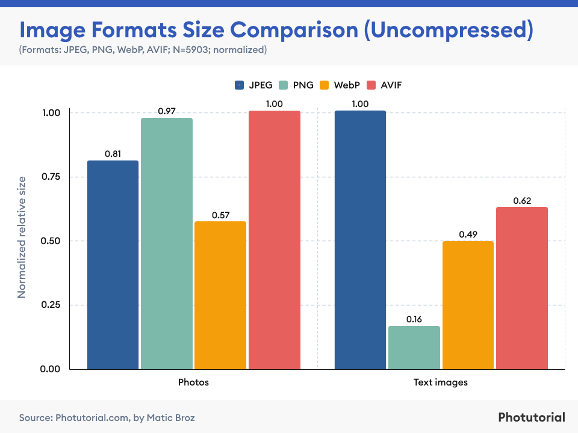
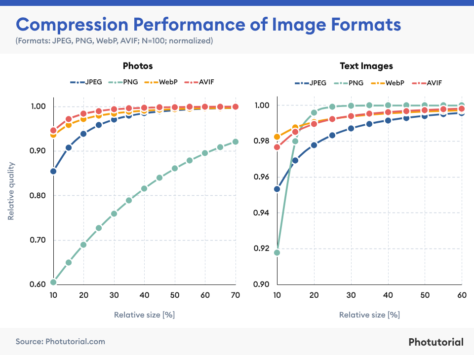

# Self Hosted Fonts

## Rationale
The main reason I decided to self host the fonts for this page is to `optimise performance`. Since google fonts are sent from the Google server itself, it will take some time before the fonts are loaded. Downloading and self hosting the fonts ensures that users will be able to view the page with the ideal fonts as quickly as possible.

## Reference
1. [hrishi. (2022, November 9). How to Self Host Google Fonts locally using CSS.](https://hrishikeshpathak.com/blog/selfhost-google-font-local/)

# Image in WEBP format

## Rationale
I chose to convert all image files into *WebP* format to also `optimise performance`, ensuring that images are loaded quickly when my page first loads.

*WebP* format images has one of the best uncompressed and compressed performances compared to other image formats such as *JPEG*, *PNG* and *AVIF*.

**Comparison of Image Formats (Uncompressed)**

**Comparison of Image Formats (Compressed)**

While the *AVIF* formatted images offers better image quality compared to *WebP* for a relatively similar compression capability, I still chose *WebP* as the format for all images on my site as this format enjoys a broader browser support, with compatibility across major browsers such as Google Chrome, Firefox, Edge, Opera and even Safari.

## Reference
1. [Matic, B. (2022, October 21). Image Format Comparison (JPEG, PNG, WEBP, & AVIF) – 2024 Statistics](https://photutorial.com/image-format-comparison-statistics/)
2. [Cloudinary. (2024, February 5). AVIF vs. WebP: 4 Key Differences and How to Choose](https://cloudinary.com/guides/image-formats/avif-vs-webp-4-key-differences-and-how-to-choose)